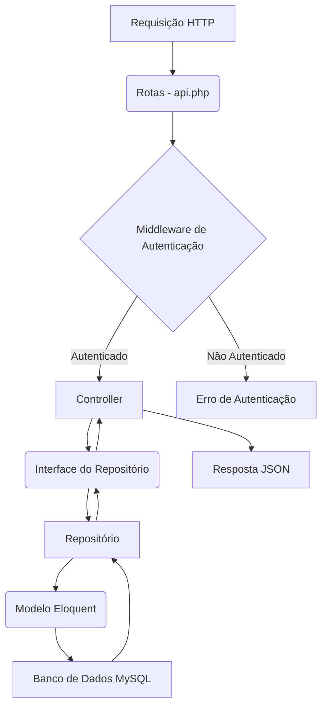

# API de Produtos

Uma API RESTful robusta para gerenciamento de produtos, desenvolvida com Laravel 9 e PHP 8.1. Esta API segue a arquitetura MVC e implementa o padrão Repository para garantir uma separação clara de responsabilidades, facilitando a manutenção e escalabilidade.

## 🚀 Funcionalidades Principais

- **Autenticação de Usuários:** Sistema de login seguro para acesso às funcionalidades protegidas.
- **Gerenciamento de Produtos:**
    - Cadastro, listagem, visualização, atualização e exclusão de produtos.
    - Produtos podem ter múltiplas imagens associadas.
- **Upload de Imagens:** Funcionalidade para upload e associação de imagens aos produtos.
- **Gerenciamento de Usuários:**
    - Cadastro, listagem, visualização, atualização e exclusão de usuários (requer autenticação).

## 🛠️ Stack Tecnológica

- **Back-end:** Laravel 9, PHP 8.1
- **Banco de Dados:** MySQL
- **Arquitetura:** MVC, Repository Pattern, Interfaces
- **Autenticação:** Laravel Sanctum (Token-based)

## 🏗️ Arquitetura do Projeto

O projeto é estruturado seguindo o padrão MVC (Model-View-Controller) com a adição do Repository Pattern para abstrair a camada de persistência de dados.



**Explicação da Arquitetura:**

1.  **Requisição HTTP:** Todas as interações com a API começam com uma requisição HTTP.
2.  **Rotas (`routes/api.php`):** Define os endpoints da API e mapeia as requisições para os Controllers apropriados.
3.  **Middleware de Autenticação (`app/Http/Middleware/TokenMiddleware.php`):** Intercepta as requisições para verificar a autenticidade do token de acesso. Requisições não autenticadas são rejeitadas.
4.  **Controllers (`app/Http/Controllers`):** Contêm a lógica de negócio principal, recebem as requisições, validam os dados (usando `Form Requests`), e coordenam as operações através dos Repositórios.
5.  **Interfaces de Repositório (`app/Contracts`):** Definem os contratos para as operações de persistência de dados, garantindo que os Controllers dependam de abstrações e não de implementações concretas.
6.  **Repositórios (`app/Repositories`):** Implementam as interfaces de repositório, contendo a lógica para interagir com os modelos Eloquent e o banco de dados. Isso desacopla a lógica de negócio da lógica de persistência.
7.  **Modelos Eloquent (`app/Models`):** Representam as tabelas do banco de dados e fornecem uma interface ORM para interagir com os dados.
8.  **Banco de Dados MySQL:** Armazena todos os dados da aplicação.
9.  **Resposta JSON:** Os Controllers retornam os dados processados em formato JSON.

## 🔄 Fluxo de Autenticação e Acesso

1.  O cliente envia uma requisição `POST` para `/api/login` com credenciais de usuário (email e senha).
2.  O `AuthController` valida as credenciais.
3.  Se as credenciais forem válidas, um token de acesso é gerado (via Laravel Sanctum) e retornado ao cliente.
4.  Para acessar rotas protegidas, o cliente deve incluir o token no cabeçalho `Authorization` como `Bearer {{token}}`.
5.  O `TokenMiddleware` verifica a validade do token antes de permitir que a requisição prossiga para o Controller.

## 📈 Próximos Passos e Melhorias Potenciais

-   **Testes de Integração:** Expandir a cobertura de testes para incluir cenários de integração mais complexos.
-   **Cache:** Implementar cache para requisições frequentes e dados estáticos para melhorar a performance.
-   **Filtragem e Ordenação:** Adicionar funcionalidades avançadas de filtragem, ordenação e busca para a listagem de produtos.
-   **Paginação Personalizada:** Oferecer opções mais flexíveis de paginação.
-   **Validação de Imagens:** Melhorar a validação de imagens (tamanho, tipo, dimensões) no upload.
-   **Notificações:** Implementar um sistema de notificações (e.g., para estoque baixo, novos produtos).
-   **Dockerização:** Fornecer um ambiente Docker para facilitar a configuração e implantação.
-   **Documentação OpenAPI/Swagger:** Gerar documentação interativa da API para facilitar o consumo por desenvolvedores.

## ⚙️ Instalação e Configuração

Para rodar o projeto localmente, siga os passos abaixo:

### 1. Clonar o Repositório

```bash
git clone https://github.com/MatheusConstantino/products-api.git
cd products-api
```

### 2. Instalar Dependências

```bash
composer install
```

### 3. Configurar o Ambiente

Crie um arquivo `.env` a partir do `.env.example` e configure as variáveis de ambiente, especialmente as do banco de dados.

```bash
cp .env.example .env
php artisan key:generate
```

Edite o arquivo `.env` com suas credenciais de banco de dados (recomenda-se criar um banco de dados chamado `ecommerce`):

```dotenv
DB_CONNECTION=mysql
DB_HOST=127.0.0.1
DB_PORT=3306
DB_DATABASE=ecommerce
DB_USERNAME=seu_usuario_mysql
DB_PASSWORD=sua_senha_mysql
```

### 4. Migrações e Seeders do Banco de Dados

Execute as migrações para criar as tabelas no banco de dados:

```bash
php artisan migrate
```

Popule o banco de dados com dados de exemplo (inclui um usuário padrão):

```bash
php artisan db:seed
```

**Usuário Padrão para Teste:**
- **Email:** `john.doe@example.com`
- **Senha:** `password123`

### 5. Linkar o Storage

Crie um link simbólico para o diretório de armazenamento público, necessário para exibir imagens:

```bash
php artisan storage:link
```

### 6. Iniciar o Servidor

```bash
php artisan serve
```

A API estará disponível em `http://127.0.0.1:8000`.

### 7. Executar Testes

```bash
php artisan test
```

## 📖 Documentação da API (Endpoints)

Todos os endpoints que requerem autenticação devem incluir o cabeçalho `Authorization: Bearer {{token}}`.

### Autenticação

#### `POST /api/login`

Autentica um usuário e retorna um token de acesso.

| Parâmetro | Tipo     | Descrição              |
| :-------- | :------- | :--------------------- |
| `email`   | `string` | **Obrigatório**. Email do usuário. |
| `password`| `string` | **Obrigatório**. Senha do usuário. |

**Exemplo de Resposta (Sucesso):**
```json
{
  "token": "seu_token_de_acesso"
}
```

### Produtos

#### `GET /api/products`

Retorna uma lista paginada de todos os produtos.

| Parâmetro | Tipo     | Descrição              |
| :-------- | :------- | :--------------------- |
| `headers/authorization` | `string` | **Obrigatório**. Bearer {{token}} |
| `?page`   | `integer`| **Opcional**. Número da página. |

**Exemplo de Resposta:**
```json
{
  "data": [
    {
      "id": 1,
      "name": "Produto Exemplo 1",
      "isbn": "1234567890123",
      "price": "99.99",
      "images": [
        {
          "image_id": 1,
          "image_path": "storage/images/image1.jpg"
        }
      ]
    }
  ],
  "pagination": {
    "total": 10,
    "per_page": 10,
    "current_page": 1,
    "last_page": 1
  }
}
```

#### `POST /api/products`

Cria um novo produto.

| Parâmetro | Tipo     | Descrição              |
| :-------- | :------- | :--------------------- |
| `headers/authorization` | `string` | **Obrigatório**. Bearer {{token}} |
| `name`    | `string` | **Obrigatório**. Nome do produto. |
| `isbn`    | `string` | **Obrigatório**. ISBN do produto. |
| `price`   | `decimal`| **Obrigatório**. Preço do produto. |
| `image_ids` | `array`  | **Opcional**. Array de IDs de imagens existentes para associar ao produto. |

**Exemplo de Resposta (Sucesso - 201 Created):**
```json
{
  "name": "Novo Produto",
  "price": "150.00",
  "isbn": "9876543210987",
  "updated_at": "2023-06-06T18:00:00.000000Z",
  "created_at": "2023-06-06T18:00:00.000000Z",
  "id": 11
}
```

#### `GET /api/products/{id}`

Retorna os detalhes de um produto específico.

| Parâmetro | Tipo     | Descrição              |
| :-------- | :------- | :--------------------- |
| `headers/authorization` | `string` | **Obrigatório**. Bearer {{token}} |
| `id`      | `integer`| **Obrigatório**. ID do produto. |

**Exemplo de Resposta:**
```json
{
  "id": 1,
  "name": "Produto Exemplo 1",
  "isbn": "1234567890123",
  "price": "99.99",
  "created_at": "2023-06-06T18:00:00.000000Z",
  "updated_at": "2023-06-06T18:00:00.000000Z",
  "images": [
    {
      "id": 1,
      "path": "storage/images/image1.jpg",
      "created_at": "2023-06-06T18:00:00.000000Z",
      "updated_at": "2023-06-06T18:00:00.000000Z",
      "pivot": {
        "product_id": 1,
        "image_id": 1
      }
    }
  ]
}
```

#### `PUT /api/products/{id}`

Atualiza um produto existente.

| Parâmetro | Tipo     | Descrição              |
| :-------- | :------- | :--------------------- |
| `headers/authorization` | `string` | **Obrigatório**. Bearer {{token}} |
| `id`      | `integer`| **Obrigatório**. ID do produto. |
| `name`    | `string` | **Obrigatório**. Novo nome do produto. |
| `isbn`    | `string` | **Obrigatório**. Novo ISBN do produto. |
| `price`   | `decimal`| **Obrigatório**. Novo preço do produto. |
| `image_ids` | `array`  | **Opcional**. Array de IDs de imagens para associar (substitui as existentes). |

**Exemplo de Resposta (Sucesso - 200 OK):**
```json
{
  "id": 1,
  "name": "Produto Atualizado",
  "price": "120.00",
  "isbn": "1234567890123",
  "created_at": "2023-06-06T18:00:00.000000Z",
  "updated_at": "2023-06-06T18:30:00.000000Z"
}
```

#### `DELETE /api/products/{id}`

Exclui um produto.

| Parâmetro | Tipo     | Descrição              |
| :-------- | :------- | :--------------------- |
| `headers/authorization` | `string` | **Obrigatório**. Bearer {{token}} |
| `id`      | `integer`| **Obrigatório**. ID do produto. |

**Exemplo de Resposta (Sucesso - 204 No Content):**
(Nenhuma resposta de conteúdo)

### Imagens

#### `POST /api/upload-image`

Faz upload de uma imagem.

| Parâmetro | Nome do Campo | Tipo     | Descrição              |
| :-------- | :------------ | :------- | :--------------------- |
| `multipart/form-data` | `image`       | `File`   | **Obrigatório**. O arquivo de imagem a ser enviado. |

**Exemplo de Resposta (Sucesso - 201 Created):**
```json
{
  "path": "storage/images/nome_da_imagem.jpg",
  "updated_at": "2023-06-06T18:00:00.000000Z",
  "created_at": "2023-06-06T18:00:00.000000Z",
  "id": 1
}
```

## 🤝 Contribuição

Sinta-se à vontade para abrir issues ou enviar pull requests para melhorias.
